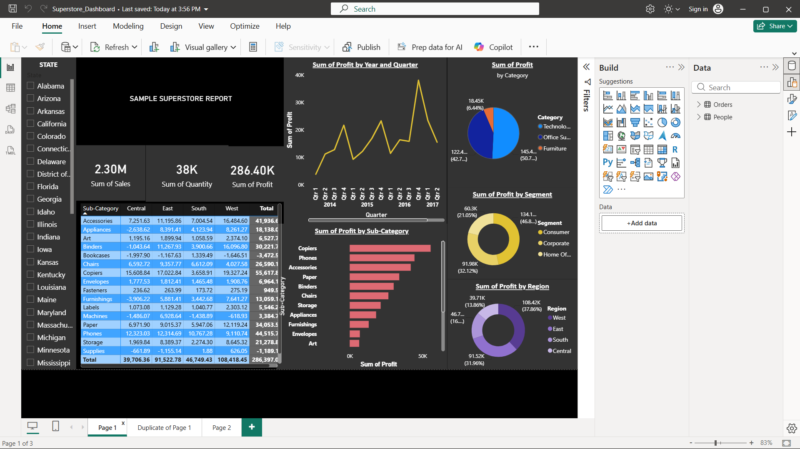
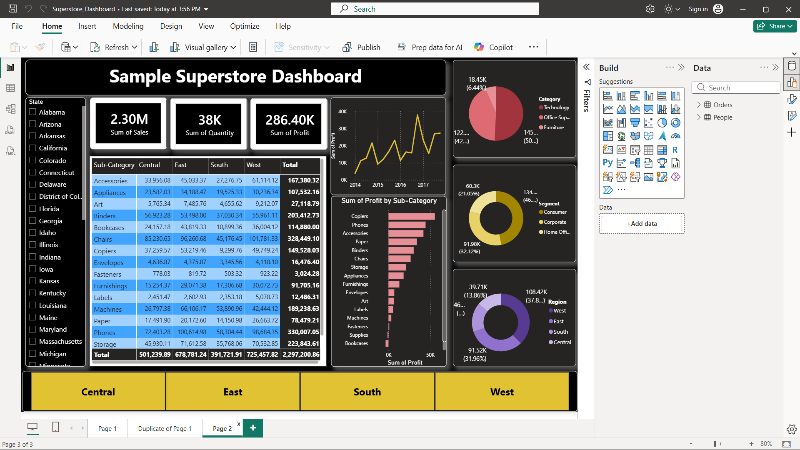

# Power BI Superstore Dashboard

An interactive **Power BI** dashboard project built using Superstore data to practice business reporting, KPI tracking, and visual data analysis.

## Project Objective

The goal of this project is to transform business data into a clear, decision-friendly dashboard that helps users quickly understand performance and identify meaningful trends.

## Dashboard Preview

### Dashboard Page 1

### Dashboard Page 2

## Repository Files

| File | Description |
|---|---|
| `Superstore_Dashboard.pbix` | Power BI dashboard file |
| `Superstore_Dashboard_1.png.png` | Dashboard preview - Page 1 |
| `Superstore_Dashboard_2.png.png` | Dashboard preview - Page 2 |
| `README.md` | Project documentation |

## Tools & Skills

- Power BI
- Dashboard Design
- Data Visualization
- KPI Reporting
- Business Analysis
- Data Storytelling

## What This Project Demonstrates

This project demonstrates my ability to organize business data into an interactive reporting experience, present KPIs clearly, and communicate insights visually — important skills for a **Data Analyst** portfolio.

## How to View

Open `Superstore_Dashboard.pbix` in **Microsoft Power BI Desktop** to explore the full interactive dashboard.
